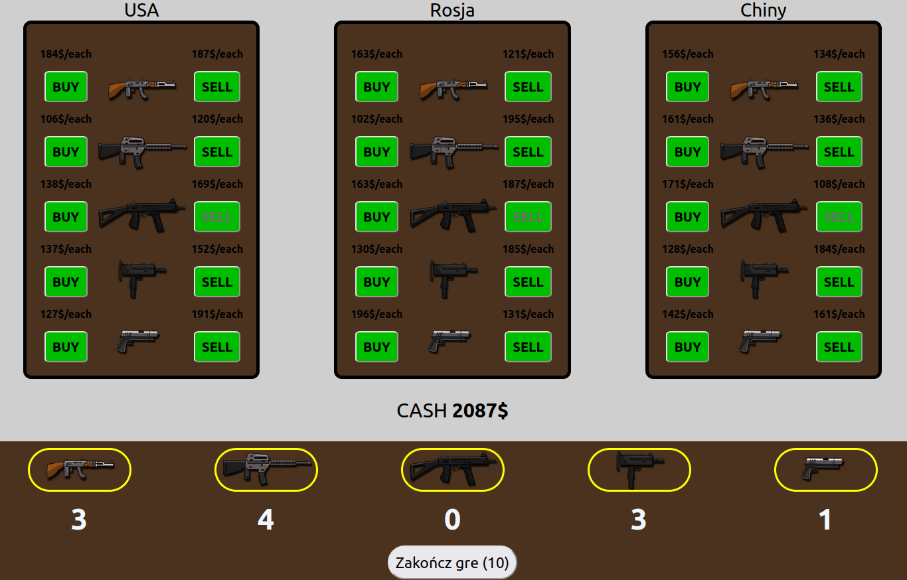
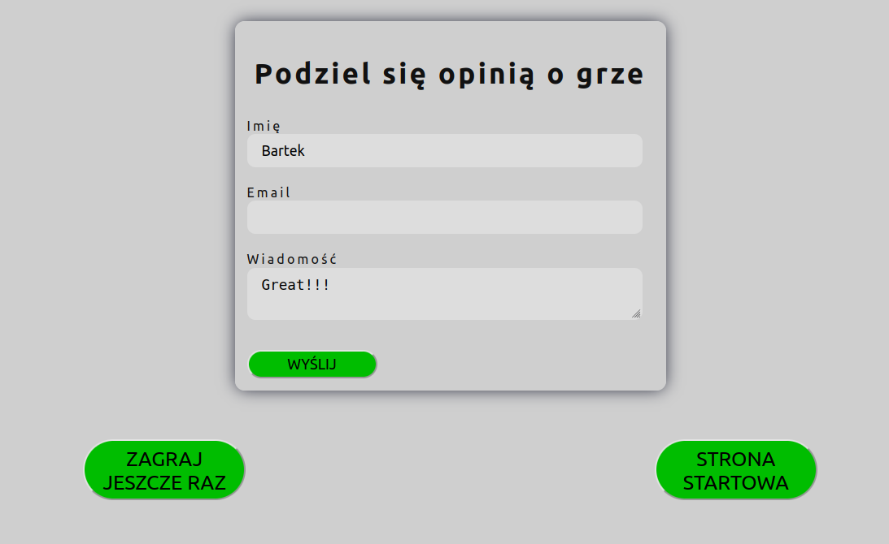

# guns dealer game

## https://guns-dealer.herokuapp.com/

<br>

# General info

The goal of the game is to get as much money as possible. You get it by selling more and buying cheaper. pay attention to the geopolitical situation and the directions appearing on the screen. Have fun
<br>
<br>




<br>

## Table of contents

- [General info](#general-info)
- [Technologies](#technologies)
- [Setup](#setup)
- [Features](#features)
- [Future Features](#future-features)
- [Project Status](#Projects)
- [Acknowledgements](#acknowledgements)
  <br>
  <br>


<br>

# Technologies:

- ReactJS
- React Context
- React Route
- NodeJS

<br>

<br>

# Setup

To run this project, install it locally using npm:

```
$ npm install
$ npm start
```
</br>

# Features

- Implemented Email functionality using node mailer.




<br>

# Project Status

Project is _in progress_

</br>

# Future features

- Random scenarios

- Difficulty levels

- Full responsiveness

- Better layout

- Rewriting the code to a cleaner form

</br>

# Acknowledgements

This project was inspired by movie 'Lord of War'
